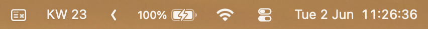

# KW Icon

KW Icon is a tiny macOS menu bar app that shows the current ISO calendar week as
`KW 23` in the menu bar:



After launching the app, hold Command and drag `KW 23` to the position you prefer.

## Build

```sh
./scripts/build.sh
```

The app bundle is created at:

```text
dist/KW Icon.app
```

Run it without installing:

```sh
open "dist/KW Icon.app"
```

## Install

Install to `~/Applications` and launch:

```sh
./scripts/install.sh
```

Install and start automatically at login:

```sh
./scripts/install.sh --login
```

Uninstall the login item:

```sh
./scripts/install.sh --uninstall-login
```

Then delete `~/Applications/KW Icon.app` if you no longer want the app.

## Releases

Check https://github.com/CiderAndWhisky/kw-icon/releases/ for new releases
